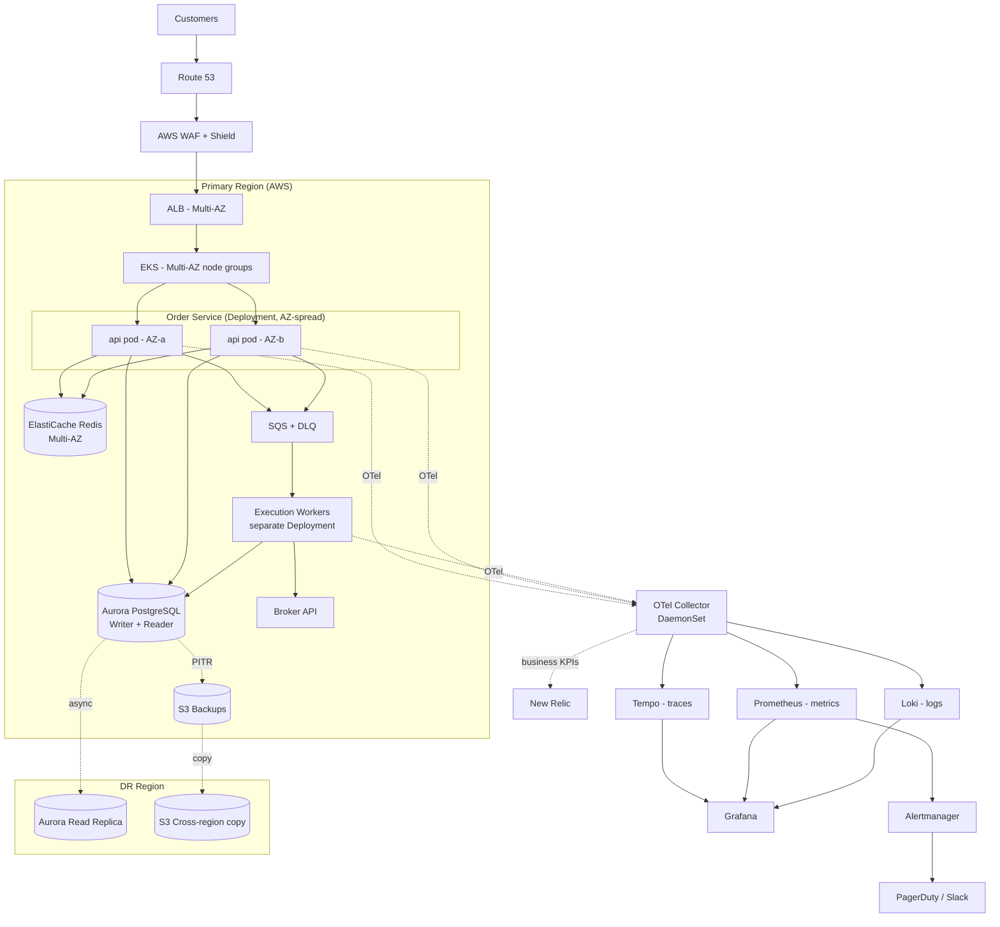

# Investment Order Service — Deployment Architecture & SLOs

## Architecture

## Compute

EKS across two AZs. Managed node groups span both zones, and the order-service pods carry anti-affinity so a single-AZ loss still leaves running replicas. The API runs a minimum of 4 replicas (effectively 2 per AZ). Execution workers run as a separate Deployment so they scale independently of submission traffic. Traffic enters through an ALB via the AWS Load Balancer Controller. Deploys are rolling with readiness gates, or blue/green via Argo Rollouts with automatic rollback on alarm.

The API uses a Horizontal Pod Autoscaler driven by CPU and request rate. Workers scale on SQS queue depth via KEDA — queue depth is the better signal for a backing-up pipeline because CPU lags behind it. Cluster Autoscaler / Karpenter handles node-level capacity underneath.

Fargate is the simpler default for a single service and carries lower operational overhead than EKS on EC2. EKS is the right choice here for two environment-specific reasons. First, the platform already runs a fleet of services, and shared orchestration with consistent deploy, scaling, and policy tooling outweighs per-service simplicity past a handful of services. Second, the observability stack relies on node-level agents — Prometheus node-exporter, a log collector, and the OTel collector — running as DaemonSets, which Fargate does not support. Fargate would force per-pod sidecars and complicate the exact part of the system this service depends on. EKS on EC2 nodes keeps that clean. If the platform team later standardizes bursty or batch workloads on Fargate profiles, the same manifests still apply.

## Database

Aurora PostgreSQL, Multi-AZ, one writer and one reader. Aurora's failover is faster than plain RDS (roughly 30s versus 1–2 minutes). A cross-region read replica covers DR.

Two design decisions matter more than the infrastructure choice:

1. **Idempotency keys.** Every order carries a client-supplied key with a unique constraint in the DB, so a client retry cannot double-execute.
2. **Outbox pattern.** The state change and the queue-publish event are written in the same DB transaction. A separate process reads the outbox and publishes to SQS, eliminating the case where an order is committed but lost before a worker picks it up.

RDS Proxy sits in front of the writer to keep connection counts manageable during spikes.

## Cache and queue

Redis handles idempotency lookups and rate limiting. It is non-authoritative: if it goes down, things slow but nothing is lost.

SQS standard queue handles execution work, with a DLQ after a few retries. FIFO is unnecessary — ordering is already enforced in the DB, so FIFO would only add cost and throughput limits.

## Failover

**AZ failure.** The ALB stops routing to the unhealthy AZ, Kubernetes reschedules lost pods onto nodes in the surviving AZ, and Aurora promotes the standby. All automatic. Anti-affinity and a pod disruption budget keep replicas spread so the service stays up through rescheduling. Target RTO under 2 minutes.

**Region failure.** Manual. Promote the cross-region replica, flip Route 53, scale up DR. Target RTO 30 minutes, RPO under 5 seconds. This stays manual because regional failovers are rare and should not be triggered by a false alarm.

The DR runbook is exercised quarterly. A failover plan nobody has run is not a plan.

## Backups

Aurora continuous backup with PITR, 35-day retention. Daily snapshots copied cross-region. Long-term archive to S3 Glacier for the regulatory retention period (to confirm with compliance — likely 7 years for investment data).

Restores are tested quarterly. An untested backup is an assumption.

## Observability

The goal is to detect issues before customers feel them and to give whoever gets paged enough context to fix the problem quickly, rather than just an alarm.

### Approach

Instrumentation goes in from the start, not after launch. Every order receives a trace ID at submission, and that ID follows it through validation, the outbox, SQS, the worker, and the broker call. Debugging means following a trace, not grepping logs and guessing.

Three signals, one place to look: metrics in Prometheus, traces in Tempo, logs in Loki, all correlated in Grafana. New Relic sits alongside for business KPIs and APM where its alerting is useful. Everything is emitted through OpenTelemetry so the backends stay swappable.

Alerts fire on symptoms and SLO burn rate, not raw resource counters. Customers care whether their order went through, not about CPU. The pager fires only when a person is actually needed.

`order_id` and `trace_id` appear on every log line and span, and attach as exemplars on key metrics. That makes it possible to go from "latency spiked" to the specific slow trace to the logs for that one request in a couple of clicks.

### The three signals in practice

**Metrics.** RED (rate, errors, duration) on each service surface and USE (utilization, saturation, errors) on resources. The business-level metrics matter most: orders accepted per second, orders executed per second, and the gap between accepted and executed. That gap is the single most useful number in the system — a growing gap means orders are stuck somewhere. Prometheus exemplars link a latency spike straight to a trace.

**Traces.** Distributed tracing across the full path: submit, validate, idempotency check, DB/outbox write, SQS, worker, broker call, record result. The broker span carries its own latency and status, so we can tell whether slowness is ours or the broker's — and our SLO is bounded by theirs, so that distinction must be answerable quickly. Tail-based sampling keeps cost down while retaining all error and slow traces.

**Logs.** Structured JSON, one event per line, each carrying `order_id`, `trace_id`, and tokenized account context (no raw PII). Tempo and Loki are linked in Grafana to jump from a span to that request's logs. Loki's label-based indexing keeps cost roughly proportional to what is queried, which matters at this scale.

### SLIs, SLOs, and alerting

The SLOs exist to drive the alerting that hangs off them. Multi-window, multi-burn-rate alerting pages immediately on a fast burn and opens a ticket on a slow burn before the budget is gone.

| SLI | Measurement | SLO | Alerting |
|---|---|---|---|
| Availability | successful submissions / total at ALB + app | 99.95% | 2% budget in 1h pages, 5% in 6h tickets |
| Submission latency | P99 of submit endpoint | P99 < 500ms | P99 breach sustained 5m pages, P95 drift tickets |
| Correctness | accepted orders that execute effectively-once | 99.999% | any confirmed duplicate or lost order is an immediate P0 |
| Execution lag | accept to broker confirmation | P99 < 30s | DLQ depth > 0 or rising lag pages |
| Broker dependency | broker span success + latency | track vs broker SLA | broker error-rate breach pages, tagged external |

### Dashboards

Each dashboard answers a specific question rather than just showing data:

1. **Order Health** — accepted vs executed, the gap between them, success rate, latency percentiles, DLQ size. The "is money moving correctly right now" screen.
2. **Service Health** — per-service RED, pod and node saturation, HPA/KEDA scaling activity, RDS Proxy connections, Redis hit rate.
3. **Dependency Health** — broker latency and errors in isolation, so a broker outage isn't mistaken for our fault.
4. **SLO and Error Budget** — burn-down per SLO, budget remaining, deploy-freeze status.
5. **Incident view** — a drill-down from alert to trace to logs in two clicks.

### MTTD and MTTR

**Detection.** Symptom-based burn-rate alerts on the accept-to-execute gap and DLQ depth catch a stuck pipeline before customers notice, rather than waiting for an error-rate threshold to trip.

**Resolution.** Every alert links to a runbook and a pre-filtered dashboard, and the `trace_id` correlation drops the responder on the failing span instead of an empty Grafana. Alerts carry context — which dependency, which AZ, recent deploy — so triage starts partway done.

Deploy markers overlay every dashboard, since most incidents line up with a change; "did this start when we deployed at 14:02" should be instant to check.

A synthetic canary submits and reconciles a test order end-to-end every minute, so a broken path is caught at low-traffic times (nights, weekends) before a real customer hits it.

Postmortems are blameless and track MTTD and MTTR over time. The observability setup is held to the same standard: did it catch this before a human reported it? A missed detection is a gap fed back into alert tuning.

## Security and hardening

**CI/CD gates.** SAST (SonarQube or Semgrep) blocking merge on high/critical, secret scanning (Gitleaks) in pre-commit and CI, dependency scanning (Dependabot/Snyk/pip-audit/npm audit) blocking on critical CVEs, container scanning (Trivy) failing on HIGH/CRITICAL with a daily re-scan, IaC scanning (tfsec/Checkov) to catch public buckets or open security groups before they ship, and Cosign-signed images enforced at admission via an OPA/Kyverno policy that rejects unsigned images.

**Testing.** Unit tests with real coverage on the validation logic, integration tests against actual Postgres and Redis via testcontainers rather than mocks, contract tests against the broker, load tests (k6/Locust) before any hot-path release, and quarterly chaos tests (kill a pod, drain a node, kill an AZ, block the broker). The chaos runs double as a check on whether the alerts fire, and fire first.

**Runtime.** Containers run non-root with a read-only root filesystem and no privileged mode, on distroless or slim base images. AWS WAF with managed and custom rules, rate limiting at the ALB and per-user in Redis, mTLS to the broker, least-privilege IAM via IRSA (per-service-account roles, no node-wide credentials), Secrets Manager with 30-day rotation and nothing in env vars, VPC endpoints so AWS-service traffic stays in the VPC, GuardDuty and Security Hub enabled with findings routed to security, and CloudTrail plus VPC Flow Logs shipped to a separate security account the app account cannot write to.

**Audit.** Append-only audit table for every order state change, kept for the regulatory period. Every privileged action (config change, manual DB write, secret access) is logged and alerted. Access reviews quarterly.

## SLOs

| SLO | Target | Reasoning |
|---|---|---|
| Availability | 99.95% | ~22 min/month. Realistic given ~30s Aurora failover. Chasing four nines pushes toward riskier patterns that hurt correctness. |
| Latency (submission) | P99 < 500ms | Should feel instant. Tracking the tail because the mean hides bad experiences. |
| Correctness | 99.999% effectively-once | The SLO that matters most here. Enforced by idempotency keys and the outbox. |

Correctness is its own SLO because investment orders are not latency-first. A customer tolerates a two-second delay but not a duplicate trade. Unmeasured correctness regresses quietly, so it is named explicitly and measured as confirmed duplicate-or-lost orders over total.

**Error budget policy.** If the availability budget burns more than 50% in a week, deploys are throttled and the focus shifts to reliability. A correctness breach of any size is a P0 with a full postmortem and a fix before anything else.

## Open questions

- Regulatory retention period — to confirm with compliance.
- Which broker and what their SLA is, since our SLO is bounded by theirs.
- Cost ceiling for cross-region plus the observability backends at scale.
- Whether to add a kill switch to pause order acceptance during incidents. Leaning yes.
- Whether we are in PCI scope or the broker owns the card side. It moves the security boundary significantly.
- Where New Relic ends and the Grafana stack begins, to avoid paying twice for the same signal.
