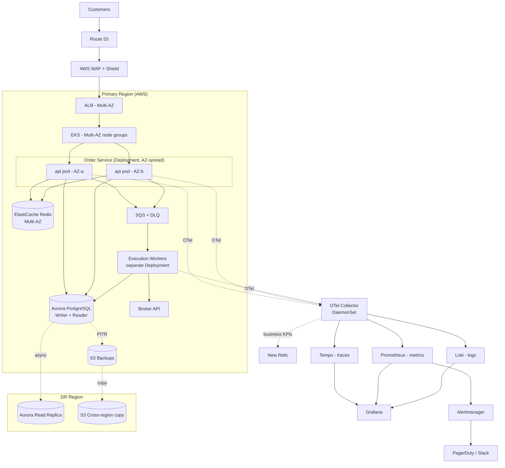

# Investment Order Service — Deployment Architecture & SLOs

SRE take-home. The service handles all investment orders end to end: accepting them, validating, routing to the broker, and recording the result. It moves customer money, so the design priorities are correctness, durability, and security, in roughly that order. Latency matters but comes after those.

I've assumed Cowrywise's environment: AWS primary, some GCP, customer base in the millions, regulated fintech. The observability section is the most detailed part because that's what the role is asking for.

## Architecture

## Compute

EKS across 2 AZs, with managed node groups spread over both zones and the order-service pods anti-affinity'd so a single AZ loss still leaves running replicas. Minimum 4 replicas (2 per AZ effectively) for the API, with the execution workers as a separate Deployment so they scale independently of submission traffic. Behind an ALB via the AWS Load Balancer Controller. Deploys are rolling with readiness gates, or blue/green via Argo Rollouts with automatic rollback if alarms fire.

Horizontal Pod Autoscaler on the API driven by CPU and request rate. The workers scale on SQS queue depth using KEDA, since queue depth is the better signal for a backing-up pipeline (CPU lags behind it). Cluster Autoscaler / Karpenter handles node-level capacity underneath.

On the choice itself: for a single service in isolation I'd actually default to Fargate to cut operational overhead, and I want to be honest that EKS carries a real cost in control-plane and node management. The reason I'd still go EKS here is specific to this environment. First, Cowrywise runs a fleet of services, and a shared orchestration platform with consistent deploy, scaling, and policy tooling is worth more than per-service simplicity once you're past a handful of services. Second, and more relevant to this role, the observability setup leans on node-level agents (Prometheus node-exporter, a log collector, the OTel collector as a DaemonSet). Plain Fargate doesn't support DaemonSets, which would force per-pod sidecars instead and complicate exactly the part of the system this role cares most about. Running EKS on EC2 nodes keeps that clean. If the platform team later standardizes parts of the fleet on Fargate profiles for bursty or batch work, the same manifests still apply.

## Database

Aurora PostgreSQL, Multi-AZ, one writer and one reader. Aurora mainly for the faster failover (roughly 30s versus 1-2 minutes on plain RDS). Cross-region read replica for DR.

Two things matter more than the infra choice here:

1. Idempotency keys. Every order carries a client-supplied key with a unique constraint in the DB, so a client retry can't double-execute.
2. Outbox pattern. The state change and the queue-publish event are written in the same DB transaction. A separate process reads the outbox and publishes to SQS. This avoids the case where an order is committed but lost before a worker picks it up.

RDS Proxy sits in front of the writer to keep connection counts manageable during spikes.

## Cache and queue

Redis for idempotency lookups and rate limiting. It's treated as non-authoritative, so if it goes down things slow down but nothing is lost.

SQS standard queue for execution work, with a DLQ after a few retries. I didn't use FIFO because ordering is already enforced in the DB, so FIFO would just add cost and throughput limits for no benefit.

## Failover

AZ failure: the ALB stops routing to the unhealthy AZ, Kubernetes reschedules the lost pods onto nodes in the surviving AZ, and Aurora promotes the standby. All automatic, no human needed. Anti-affinity and a pod disruption budget keep replicas spread so the service stays up through the rescheduling. Target RTO under 2 minutes.

Region failure: manual call. Promote the cross-region replica, flip Route 53, scale up DR. Target RTO 30 minutes, RPO under 5 seconds. I kept this manual because regional failovers are rare and I'd rather not have one triggered by a false alarm.

The DR runbook should be exercised quarterly. A failover plan nobody has run isn't really a plan.

## Backups

Aurora continuous backup with PITR, 35-day retention. Daily snapshots copied cross-region. Long-term archive to S3 Glacier for the regulatory retention period (needs confirming with compliance, probably 7 years for investment data).

Restores tested quarterly, same reasoning as the DR runbook. An untested backup is an assumption.

## Observability

This is the part the role cares most about, so it's the most detailed. The thing I'm optimizing for is detecting issues before customers feel them, and giving whoever gets paged enough context to fix it quickly rather than just an alarm.

### Approach

Instrumentation goes in from the start, not after launch. Every order gets a trace ID at submission and that ID follows it through validation, the outbox, SQS, the worker, and the broker call. So debugging usually means following a trace rather than grepping logs and guessing.

Three signals, one place to look. Metrics in Prometheus, traces in Tempo, logs in Loki, all correlated in Grafana. New Relic sits alongside for business KPIs and APM where its alerting is useful. Everything is emitted through OpenTelemetry so the backends stay swappable.

Alerts are based on symptoms and SLO burn rate, not raw resource counters. Customers don't care about CPU, they care whether their order went through. The aim is a pager that only fires when a person is actually needed.

order_id and trace_id are on every log line and span, and attached as exemplars on the key metrics. That's what makes it possible to go from "latency spiked" to the specific slow trace to the logs for that one request in a couple of clicks.

### The three signals in practice

Metrics: RED (rate, errors, duration) on each service surface and USE (utilization, saturation, errors) on resources. The ones that matter most for this service are the business-level metrics: orders accepted per second, orders executed per second, and the gap between accepted and executed. That gap is the single most useful number in the system, because a growing gap means orders are getting stuck somewhere. Prometheus exemplars link a latency spike straight to a trace.

Traces: distributed tracing across the full path (submit, validate, idempotency check, DB/outbox write, SQS, worker, broker call, record result). The broker span carries its own latency and status so we can tell whether slowness is ours or the broker's. Our SLO is bounded by theirs, so that distinction needs to be answerable quickly. Tail-based sampling keeps cost down while still keeping all error and slow traces.

Logs: structured JSON, one event per line, each carrying order_id, trace_id, and tokenized account context (no raw PII). Tempo and Loki are linked in Grafana so you can jump from a span to that request's logs. Loki specifically because label-based indexing keeps cost roughly proportional to what you query, which matters at this scale.

### SLIs, SLOs, and alerting

The reason the SLOs are worth defining is the alerting that hangs off them. Multi-window, multi-burn-rate alerting means a fast burn pages immediately and a slow burn opens a ticket before the budget is actually gone.

| SLI | Measurement | SLO | Alerting |
|---|---|---|---|
| Availability | successful submissions / total at ALB + app | 99.95% | 2% budget in 1h pages, 5% in 6h tickets |
| Submission latency | P99 of submit endpoint | P99 < 500ms | P99 breach sustained 5m pages, P95 drift tickets |
| Correctness | accepted orders that execute exactly once | 99.999% | any confirmed duplicate or lost order is an immediate P0 |
| Execution lag | accept to broker confirmation | P99 < 30s | DLQ depth > 0 or rising lag pages |
| Broker dependency | broker span success + latency | track vs broker SLA | broker error-rate breach pages, tagged external |

### Dashboards

I'd build these to answer a specific question rather than just show data:

1. Order Health: accepted vs executed, the gap between them, success rate, latency percentiles, DLQ size. This is the "is money moving correctly right now" screen.
2. Service Health: per-service RED, pod and node saturation, HPA/KEDA scaling activity, RDS Proxy connections, Redis hit rate.
3. Dependency Health: broker latency and errors on their own, so we don't blame ourselves for their outage.
4. SLO and Error Budget: burn-down per SLO, budget left, deploy-freeze status.
5. Incident view: a drill-down that goes alert to trace to logs in two clicks.

### MTTD and MTTR

The role specifically mentions reducing both, so to be concrete:

For detection, the symptom-based burn-rate alerts on the accept-to-execute gap and DLQ depth catch a stuck pipeline before customers notice, rather than waiting for an error-rate threshold to trip.

For resolution, every alert links to a runbook and a pre-filtered dashboard, and the trace_id correlation drops the responder on the failing span instead of an empty Grafana. Alerts carry context (which dependency, which AZ, recent deploy) so triage starts partway done.

Deploy markers are overlaid on every dashboard, since most incidents line up with a change and "did this start when we deployed at 14:02" should be instant to check.

A synthetic canary submits and reconciles a test order end to end every minute. That way a broken path gets caught at low-traffic times (nights, weekends) before a real customer hits it.

Postmortems are blameless and track MTTD and MTTR over time. I'd also hold the observability setup itself to a standard: did it catch this before a human reported it? A missed detection is a gap to feed back into alert tuning.

## Security and hardening

For a fintech this is a big chunk of the work.

CI/CD gates: SAST (SonarQube or Semgrep) blocking merge on high/critical, secret scanning (Gitleaks) in pre-commit and CI, dependency scanning (Dependabot/Snyk/pip-audit/npm audit) blocking on critical CVEs, container scanning (Trivy) failing on HIGH/CRITICAL plus a daily re-scan, IaC scanning (tfsec/Checkov) to catch public buckets or open security groups before they ship, and Cosign-signed images enforced at admission (an OPA/Kyverno policy rejects unsigned images).

Testing: unit tests with real coverage on the validation logic, integration tests against actual Postgres and Redis via testcontainers rather than mocks, contract tests against the broker, load tests (k6/Locust) before any hot-path release, and quarterly chaos tests (kill a pod, drain a node, kill an AZ, block the broker). The chaos runs double as a check on whether the alerts actually fire and fire first.

Runtime: containers run non-root with a read-only root filesystem and no privileged mode, on distroless or slim base images. AWS WAF with managed and custom rules, rate limiting at the ALB and per-user in Redis, mTLS to the broker, least-privilege IAM via IRSA (per-service-account roles, no node-wide credentials), Secrets Manager with 30-day rotation and nothing in env vars, VPC endpoints so AWS-service traffic stays in the VPC, GuardDuty and Security Hub on with findings routed to security, and CloudTrail plus VPC Flow Logs shipped to a separate security account the app account can't write to.

Audit: append-only audit table for every order state change kept for the regulatory period, every privileged action (config change, manual DB write, secret access) logged and alerted, and quarterly access reviews.

## SLOs

| SLO | Target | Reasoning |
|---|---|---|
| Availability | 99.95% | About 22 min/month. Honest given ~30s Aurora failover. Chasing four nines pushes you toward riskier patterns that hurt correctness. |
| Latency (submission) | P99 < 500ms | Should feel instant. Tracking the tail because the mean hides bad experiences. |
| Correctness | 99.999% exactly-once | The one that actually matters here. Enforced by idempotency keys and the outbox. |

The reasoning behind making correctness its own SLO: investment orders aren't latency-first. A customer will tolerate a two-second delay but not a duplicate trade. If correctness isn't measured explicitly it tends to regress quietly, so it gets named.

Error budget policy: if the availability budget burns more than 50% in a week, deploys get throttled and the focus shifts to reliability. A correctness breach of any size is a P0 with a full postmortem and a fix before anything else.

## Open questions

- Regulatory retention period, to confirm with compliance.
- Which broker and what their SLA is, since our SLO is bounded by theirs.
- Cost ceiling for cross-region plus the observability backends at scale.
- Whether we want a kill switch to pause order acceptance during incidents. I'd lean yes.
- Whether we're in PCI scope or the broker owns the card side. It moves the security boundary a fair bit.
- Where New Relic ends and the Grafana stack begins, so we're not paying twice for the same signal.
