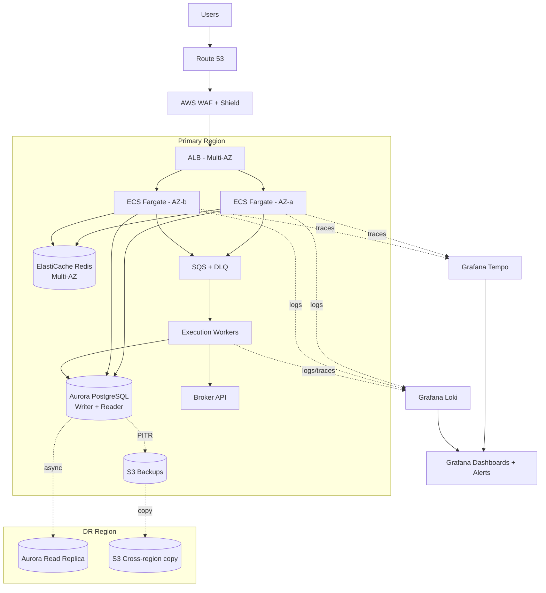

# Investment Order Service — Architecture & SLO

## What this is

A microservice that handles all investment orders — accepting them, validating, routing to the broker, and recording the result. Because it moves user money, the design leans hard on correctness, durability, and security. Latency matters, but not as much as not losing or duplicating an order, and not as much as keeping attackers out.

## Architecture

## Compute

ECS Fargate across 2 AZs, minimum 2 tasks per AZ so an AZ going down still leaves you with capacity. Behind an ALB. Auto-scales on CPU and SQS queue depth. Blue/green deploys with automatic rollback if alarms fire.

Picked Fargate over EKS because there's less to operate. For a service that wakes people up at night, fewer layers to debug is worth the cost premium.

## Database

Aurora PostgreSQL, Multi-AZ, one writer + one reader. Aurora over plain RDS because failover is faster (~30s vs ~1-2min). Cross-region read replica in the DR region for disaster recovery.

Two things that matter more than the infra choice:

1. **Idempotency keys.** Every order carries a client-supplied key with a unique constraint in the DB. If the client retries, we don't double-execute. Non-negotiable for an order system.
2. **Outbox pattern.** State changes and the "publish to queue" event get written in the same DB transaction. A separate process reads the outbox and publishes to SQS. An order can't be committed to the DB but lost before reaching the worker.

RDS Proxy in front of the writer keeps connection counts sane during traffic spikes.

## Cache and queue

Redis for idempotency lookups and rate limiting. Treated as non-authoritative — if Redis dies, things get slower but nothing is lost.

SQS standard queue for execution work, with a dead-letter queue after a few retries. Not using FIFO because ordering is already enforced in the DB; FIFO would just add cost and throughput limits.

## Failover

**AZ failure:** ALB stops sending traffic to the bad AZ, Aurora promotes the standby. Automatic, no human needed. Target RTO under 2 minutes.

**Region failure:** Manual call. Promote the cross-region replica, flip Route 53, scale up the DR region. Target RTO 30 minutes, RPO under 5 seconds. Manual because regional failovers are rare and you don't want them happening on a false alarm.

DR runbook gets exercised quarterly. A failover plan you've never run is wishful thinking.

## Backups

Aurora continuous backup with point-in-time recovery, 35-day retention. Daily snapshots copied cross-region. Long-term archive to S3 Glacier for the regulatory retention period (need to confirm with compliance, probably 7 years for investment data).

Backup restores are tested quarterly. Same logic as the DR runbook.

## Observability

Traces go to Grafana Tempo via the OpenTelemetry SDK. Every order gets a trace ID at submission that follows it all the way to the broker call, so when something is slow we can see which span is to blame instead of guessing.

Logs ship to Grafana Loki — structured JSON with the order ID and trace ID on every line. Tempo and Loki are linked in Grafana, so clicking a slow trace jumps you to the logs for that exact request. Metrics come from Prometheus. One Grafana instance, three data sources, one place to debug.

Dashboards cover order success rate, latency percentiles, queue depth, DB connection pool usage, and DLQ size. Alerts fire on SLO burn rate, not raw error counts.

## Security and application hardening

For a fintech, this is half the work.

### CI/CD pipeline security

Nothing reaches production without passing through these gates:

- **SAST** — SonarQube or Semgrep on every PR. Blocks merge on high/critical findings.
- **Secret scanning** — Gitleaks in pre-commit and CI. A leaked DB password is a P0 even in a private repo.
- **Dependency scanning** — Dependabot + Snyk (or `pip-audit` / `npm audit`) on every PR. Critical CVEs block merge.
- **Container image scanning** — Trivy scans the image after build. Fails the pipeline on HIGH or CRITICAL vulnerabilities. Images are also re-scanned daily because new CVEs get published against images that were clean yesterday.
- **IaC scanning** — `tfsec` or Checkov on Terraform. Catches things like public S3 buckets or security groups open to 0.0.0.0/0 before they ship.
- **Signed images** — images signed with Cosign, ECS only pulls signed images.

### Automated testing

- **Unit tests** with meaningful coverage (chasing a coverage number is a trap, but order validation logic should be near 100%).
- **Integration tests** against a real Postgres and Redis in CI (testcontainers), not mocks. Mocks lie about transaction behavior.
- **Contract tests** against the broker API so their changes don't silently break us.
- **Load tests** with k6 or Locust before any release that changes the hot path. Run against a staging environment that mirrors prod.
- **Chaos tests** quarterly — kill a task, kill an AZ, block the broker API, and confirm we degrade gracefully.

### Runtime hardening

- Containers run as **non-root**, read-only root filesystem, no privileged mode.
- Minimal base images (distroless or `-slim`). Smaller image, smaller attack surface.
- **AWS WAF** with managed rule sets plus custom rules for known abuse patterns (credential stuffing, scraping, geo-blocking where required).
- **Rate limiting** at the ALB and per-user in Redis.
- **mTLS** to the broker. They should be authenticating us, not just an API key.
- **Per-task IAM roles**, least privilege. No shared credentials.
- **Secrets Manager** for DB credentials and broker keys, rotated every 30 days. Nothing in env vars or config files.
- **VPC endpoints** for AWS services so traffic to S3, SQS, etc. doesn't leave the VPC.
- **GuardDuty** and **Security Hub** enabled, findings routed to the security channel.
- **CloudTrail** and **VPC Flow Logs** shipped to a separate security account that the application account can't write to.

### Audit and compliance

- Every order state change written to an append-only audit table, retained for the regulatory period.
- Every privileged action (config change, manual DB write, secret access) logged and alerted on.
- Quarterly access reviews — who can touch prod, why, and is that still justified.

## SLOs

| SLO | Target | Why |
|---|---|---|
| Availability | 99.95% | About 22 min downtime/month. Achievable with Multi-AZ. Anything higher is hard to honestly promise when Aurora failover takes ~30s. |
| Latency (submission) | P99 < 500ms | Orders should feel instant. Tracking the tail because the mean hides bad experiences. |
| Correctness | 99.999% of accepted orders execute exactly once | The one that actually matters for an order system. Enforced by idempotency keys and the outbox pattern. |

### Why these numbers

Investment orders are correctness-first, not latency-first. Users will live with a 2-second delay. They won't live with a duplicate trade. The SLOs reflect that — picking 99.95% over 99.99% on availability because chasing four nines pushes you toward riskier patterns that hurt correctness, and adding correctness as a named SLO because if you don't measure it, it regresses.

### Error budget

If availability budget burns more than 50% in a week, deploys get throttled and the team focuses on reliability. If correctness budget is breached at all, it's a P0 — full postmortem, fix before anything else.

## Open questions

- Regulatory retention period — confirm with compliance.
- Which broker we're routing to and their SLA (our SLO is bounded by theirs).
- Cost ceiling for the cross-region setup.
- Do we want a kill switch to pause order acceptance during incidents? I'd argue yes.
- Do we need PCI scope, or does the broker handle the card side? Affects the security boundary significantly.
